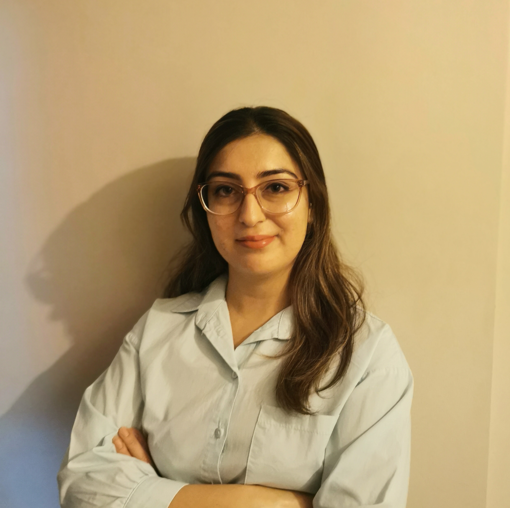

{fig-align="left" width="225"}

# Education

-   B.S., Industrial Engineering, İ.D. Bilkent University, Turkey, 2012 - 2017.
-   M.S., Industrial Engineering, Hacettepe University, Turkey, 2025 - ongoing.

# Work Experience

## Employements

1.  ASELSAN, Product Manager, 2025 - ongoing.

2.  ASELSAN, Project Manager, 2023 - 2025.

3.  ASELSAN, Project Engineer, 2023 - ongoing.

4.  MilSOFT Software Technologies, Program Manager, 2021 - 2023.

5.  MilSOFT Software Technologies, Proposal Specialist, 2017 - 2021.

## Internships

1.  ASELSAN, Intern, 2015.

2.  SAMPA Otomotiv, Intern, 2014.

# Projects

\-

# Publications

\-

# Competencies

Project Management, Product Management, Subcontract Management, Project Planning, R, Quarto, Git

# Hobbies

Reading, Knitting

[[*CV Download Link*]{.underline}](assets/BurcuOzmen_CV.pdf "CV Download Link"){target="_blank"}

{fig-alt="Burcu Ozmen cv" fig-align="left"}
