Welcome to my project page.

Keep an eye on this space to stay updated with my project activities.

# 1. Project Overview and Scope

Livability is a multi-dimensional concept that reflects the overall quality of living considering economic, social, infrastructural and environmental factors. This project aims to construct a **city-level livability index for Türkiye** by integrating multiple indicators and rank cities according to their overall livability.

In the first phase, I will intuitively select the top 3 most livable cities from each geographical region of Türkiye. These intuitive selections will be used at the end of the project, to compare the results of the developed city-level livability index.

For the development phase, data sets from official sources will be used. I will rank the cities using relevant indicators. Then, the method for "Livability Index for Cities of Türkiye" will be constructed.

In the last phase, the cities will be ranked according to their livability indeces. I will again determine the top 3 most livable cities for each region using the developed method and compare the results with the intuitive selections from the beginning of the project.

# 2. Data

This project will use multiple publicly available data sets collected from official sources. The data will be integrated at the city level. Some geographical region level data will be calculated through the project.

## 2.1 Data Source

The primary data source of the model consists of city level data sets obtained from the Türkiye İstatistik Kurumu (TÜİK) data portal.

## 2.2 General Information About Data

The data sets are publicly available and can be downloaded in MS Excel format from TÜİK data portal. For each selected indicator, data covering the period between 2021 and the most recent year (2025 or 2024) available will be downloaded.

+--------------------------------+------------+-------------+--------------------------------------------------+
| Data Indicator                 | Category   | Unit        | Notes                                            |
+================================+============+=============+==================================================+
| Bakanlığa bağlı müze sayısı    | Culture    | Count       | Will be divided by population.                   |
|                                |            |             |                                                  |
|                                |            |             | Higher is better.                                |
+--------------------------------+------------+-------------+--------------------------------------------------+
| Halk Kütüphanesi Sayısı        | Culture    | Count       | Will be divided by population.                   |
|                                |            |             |                                                  |
|                                |            |             | Higher is better.                                |
+--------------------------------+------------+-------------+--------------------------------------------------+
| Sinema Salonu Sayısı           | Culture    | Count       | Will be divided by population.                   |
|                                |            |             |                                                  |
|                                |            |             | Higher is better.                                |
+--------------------------------+------------+-------------+--------------------------------------------------+
| Tiyatro Salonu Sayısı          | Culture    | Count       | Will be divided by population.                   |
|                                |            |             |                                                  |
|                                |            |             | Higher is better.                                |
+--------------------------------+------------+-------------+--------------------------------------------------+
| Bebek Ölüm Hızı                | Health     | ‰           | Lower is better. (Reverse min-max normalization) |
+--------------------------------+------------+-------------+--------------------------------------------------+
| 5 Yaş Altı Ölüm Hızı           | Health     | ‰           | Lower is better. (Reverse min-max normalization) |
+--------------------------------+------------+-------------+--------------------------------------------------+
| Hastane Sayısı                 | Health     | count       | Will be divided by population.                   |
|                                |            |             |                                                  |
|                                |            |             | Higher is better.                                |
+--------------------------------+------------+-------------+--------------------------------------------------+
| 100k Kişi Başına Yatak Sayısı  | Health     | Rate        | Higher is better.                                |
+--------------------------------+------------+-------------+--------------------------------------------------+
| 1000 Kişi Başına Hekim Sayısı  | Health     | Rate        | Higher is better.                                |
+--------------------------------+------------+-------------+--------------------------------------------------+
| Derslik Başına Öğrenci Sayısı  | Education  | Rate        | Lower is better. (Reverse min-max normalization) |
+--------------------------------+------------+-------------+--------------------------------------------------+
| Öğretmen Başına Öğrenci Sayısı | Education  | Rate        | Lower is better. (Reverse min-max normalization) |
+--------------------------------+------------+-------------+--------------------------------------------------+
| GSYH                           | Economy    | Thosand TL  | Higher is better.                                |
+--------------------------------+------------+-------------+--------------------------------------------------+
| İşgücüne Katılma Oranı         | Economy    | \%          | Higher is better.                                |
+--------------------------------+------------+-------------+--------------------------------------------------+
| İşsizlik Oranı                 | Economy    | \%          | Lower is better. (Reverse min-max normalization) |
+--------------------------------+------------+-------------+--------------------------------------------------+
| İstihdam Oranı                 | Economy    | \%          | Higher is better.                                |
+--------------------------------+------------+-------------+--------------------------------------------------+
| Toplam Girişim Sayısı          | Economy    | Count       | Higher is better.                                |
+--------------------------------+------------+-------------+--------------------------------------------------+
| Toplam İhracat                 | Economy    | Thosand USD | Higher is better.                                |
+--------------------------------+------------+-------------+--------------------------------------------------+

: General Information About Data

## 2.3 Reason of Choice

The project was chosen because it is suitable to apply the topics that we discussed in this lecture and also other lectures.

## 2.4 Preprocessing

Following approach will be adopted:

-   All selected data sets will be transformed into tidy data format.

-   The indicators will be grouped into categories such as economic conditions, health, education, culture.

-   Some data are absolute counts that scale with province size. These data will be divided by the province's population to ensure that large provinces are not unfairly advantaged/disadvantaged.

-   Rather than selecting a single reference year, average values will be calculated for each city and each indicator. This approach reduces sensitivity to year-specific anomalies and ensures that each city is represented by a single value per indicator, reducing the impact of short-term fluctuations in data.

-   To enable comparability across different indicators with varying units and scales, all variables will be normalized with min-max normalization where 1 is the most livable province.

For preprocess of the data, AI is used. The prompt used is presented in Chapter-6.

```         
---
# GEREKLİ PAKETLER (ilk çalıştırmadan önce bir kez kurun):
# install.packages(c(
#   "readxl", "dplyr", "tidyr", "stringr", "readr",
#   "ggplot2", "scales", "forcats", "ggrepel",
#   "RColorBrewer", "fmsb", "corrplot", "patchwork",
#   "gridExtra", "GGally"
# ))

# ============================================================
# AŞAMA 1: Veri Okuma, Temizleme ve Düzenleme
# ============================================================
#
# Bu script şunları yapar:
#   1. Ham Excel dosyalarını okur
#   2. Geniş (wide) formattan uzun (long) tidy formata dönüştürür
#   3. En son yılın verisini seçer (2024)
#   4. Nüfusa bölünmesi gereken değişkenleri normalleştirir
#   5. Temizlenmiş veriyi birleştirerek tek bir ana tablo oluşturur
#   6. Temiz veriyi CSV olarak kaydeder

# ============================================================

# ---- 0. GEREKLİ PAKETLERİ YÜKLE ----
# Eğer bu paketler kurulu değilse, önce şunu çalıştırın:
# install.packages(c("readxl", "dplyr", "tidyr", "stringr"))

library(readxl)   # Excel dosyalarını okumak için
library(dplyr)    # Veri manipülasyonu için (filter, mutate, select, vb.)
library(tidyr)    # Veriyi tidy formata dönüştürmek için (pivot_longer)
library(stringr)  # Metin işlemleri için (str_trim)

# ---- 1. KLASÖR YOLLARINI TANIMLA ----

veri_klasoru <- "data/raw"

cikti_klasoru <- "output"

# ---- 2. YARDIMCI FONKSİYON: Ham Excel'i Tidy Formata Dönüştür ----
#
# Tüm Excel dosyaları aynı yapıya sahip:
#   - Satır 1 (index 1): Değişken adı (örn. "GSYH (bin TL)")
#   - Satır 4 (index 4): İl isimleri (sütun başlıkları)
#   - Satır 5-8 (index 5-8): Yıllara göre veriler (2021, 2022, 2023, 2024)
#
# Bu fonksiyon bu yapıyı okuyup temiz bir data.frame döndürür.

excel_oku_temizle <- function(dosya_yolu, degisken_adi) {
  
  # Excel'i başlıksız oku (header=FALSE), tüm satırları görmek için
  ham_veri <- read_excel(dosya_yolu, col_names = FALSE)
  
  # İl isimlerinin bulunduğu satırı bul (Türkiye'yi içeren satır)
  # Bu genellikle 4. satır (R'da index 4)
  il_satiri <- which(apply(ham_veri, 1, function(x) any(x == "Türkiye", na.rm = TRUE)))

  # İl isimlerini al (Türkiye dahil - onu sonra çıkaracağız)
  il_isimleri <- as.character(ham_veri[il_satiri, ])
  
  # Yıl sütununu bul (yıl değerlerinin olduğu sütun - genellikle 3. sütun, index 3)
  # Veri satırları il satırından sonra başlar
  veri_baslangic <- il_satiri + 1
  veri_bitis <- nrow(ham_veri)
  
  # Yıl sütununu bul: NA olmayan sayısal değer içeren sütun
  yil_sutunu <- NA
  for (s in 1:ncol(ham_veri)) {
    degerler <- ham_veri[veri_baslangic:veri_bitis, s]
    sayisal <- suppressWarnings(as.numeric(unlist(degerler)))
    if (any(!is.na(sayisal) & sayisal > 2000 & sayisal < 2030)) {
      yil_sutunu <- s
      break
    }
  }
  
  # Veri satırlarını al
  veri_satirlari <- ham_veri[veri_baslangic:veri_bitis, ]
  
  # Yılları çıkar
  if (!is.na(yil_sutunu)) {
    yillar <- as.numeric(unlist(veri_satirlari[, yil_sutunu]))
  } else {
    # Yıl sütunu yoksa 2021'den başlayarak sıralı yıllar ata
    yillar <- seq(2021, length.out = nrow(veri_satirlari))
    cat("  NOT: Yıl sütunu otomatik atandı.\n")
  }
  
  # Sayısal veri sütunlarını belirle
  # İl isimleri satırında değer olan sütunları bul
  veri_sutunlari <- which(!is.na(il_isimleri) & il_isimleri != "NA")
  
  # Türkiye'yi çıkar (sadece il verileri istiyoruz)
  turkiye_sutunu <- which(il_isimleri == "Türkiye")
  veri_sutunlari <- veri_sutunlari[veri_sutunlari != turkiye_sutunu]
  
  # Sonuç tablosunu oluştur
  sonuc_listesi <- list()
  
  for (i in seq_along(yillar)) {
    yil <- yillar[i]
    if (is.na(yil)) next
    
    satir <- veri_satirlari[i, ]
    
    for (s in veri_sutunlari) {
      il_adi <- str_trim(as.character(il_isimleri[s]))
      deger_ham <- as.character(satir[[s]])
      
      # Sayısal değere dönüştür (nokta binlik ayırıcı olabilir)
      deger_ham <- gsub("\\.", "", deger_ham)   # Noktaları kaldır (1.000 -> 1000)
      deger_ham <- gsub(",", ".", deger_ham)    # Virgülü noktaya çevir (1,5 -> 1.5)
      deger <- suppressWarnings(as.numeric(deger_ham))
      
      sonuc_listesi[[length(sonuc_listesi) + 1]] <- data.frame(
        il = il_adi,
        yil = yil,
        degisken = degisken_adi,
        deger = deger,
        stringsAsFactors = FALSE
      )
    }
  }
  
  # Listeyi tek bir data.frame'e birleştir
  if (length(sonuc_listesi) == 0) return(NULL)
  
  sonuc <- bind_rows(sonuc_listesi)
  
  return(sonuc)
}

# ---- 3. TÜM EXCEL DOSYALARINI OKU ----

# Sağlık kategorisi değişkenleri
bebek_olum <- excel_oku_temizle(
  file.path(veri_klasoru, "bebek_olum_hizi.xlsx"),
  "bebek_olum_hizi"
)

cocuk_olum <- excel_oku_temizle(
  file.path(veri_klasoru, "cocuk_olum_hizi.xlsx"),
  "cocuk_olum_hizi"
)

hastane_sayi <- excel_oku_temizle(
  file.path(veri_klasoru, "hastane_sayisi.xlsx"),
  "hastane_sayisi"
)

hastane_yatak <- excel_oku_temizle(
  file.path(veri_klasoru, "hastane_yatak_sayisi.xlsx"),
  "hastane_yatak_sayisi"
)

hekim_sayi <- excel_oku_temizle(
  file.path(veri_klasoru, "toplam_hekim_sayisi.xlsx"),
  "toplam_hekim_sayisi"
)

# Eğitim kategorisi değişkenleri
derslik_ogrenci <- excel_oku_temizle(
  file.path(veri_klasoru, "derslik_basina_ogrenci.xlsx"),
  "derslik_basina_ogrenci"
)

ogretmen_ogrenci <- excel_oku_temizle(
  file.path(veri_klasoru, "ogretmen_basina_ogrenci.xlsx"),
  "ogretmen_basina_ogrenci"
)

# Kültür kategorisi değişkenleri
muze_sayi <- excel_oku_temizle(
  file.path(veri_klasoru, "bakanliga_bagli_muze_sayisi.xlsx"),
  "muze_sayisi"
)

kutuphane_sayi <- excel_oku_temizle(
  file.path(veri_klasoru, "halk_kutuphanesi_sayisi.xlsx"),
  "kutuphane_sayisi"
)

sinema_sayi <- excel_oku_temizle(
  file.path(veri_klasoru, "sinema_sayisi.xlsx"),
  "sinema_sayisi"
)

tiyatro_sayi <- excel_oku_temizle(
  file.path(veri_klasoru, "tiyatro_sayisi.xlsx"),
  "tiyatro_sayisi"
)

# Ekonomi kategorisi değişkenleri
gsyh <- excel_oku_temizle(
  file.path(veri_klasoru, "GSYH.xlsx"),
  "GSYH"
)

isgucune_katilma <- excel_oku_temizle(
  file.path(veri_klasoru, "isgucune_katilma.xlsx"),
  "isgucune_katilma_orani"
)

issizlik <- excel_oku_temizle(
  file.path(veri_klasoru, "issizlik_orani.xlsx"),
  "issizlik_orani"
)

istihdam <- excel_oku_temizle(
  file.path(veri_klasoru, "istihdam_orani.xlsx"),
  "istihdam_orani"
)

girisim_sayi <- excel_oku_temizle(
  file.path(veri_klasoru, "toplam_girisim_sayisi.xlsx"),
  "girisim_sayisi"
)

ihracat <- excel_oku_temizle(
  file.path(veri_klasoru, "toplam_ihracat.xlsx"),
  "ihracat"
)

# Nüfus verisi (normalizasyon için)
nufus <- excel_oku_temizle(
  file.path("data", "toplam_nufus.xlsx"),
  "nufus"
)

# ---- 4. TÜM VERİLERİ BİRLEŞTİR ----

# Tüm data.frame'leri bir listeye koy
tum_veriler <- list(
  bebek_olum, cocuk_olum, hastane_sayi, hastane_yatak, hekim_sayi,
  derslik_ogrenci, ogretmen_ogrenci,
  muze_sayi, kutuphane_sayi, sinema_sayi, tiyatro_sayi,
  gsyh, isgucune_katilma, issizlik, istihdam, girisim_sayi, ihracat,
  nufus
)

# NULL olanları filtrele ve hepsini birleştir
tum_veriler <- tum_veriler[!sapply(tum_veriler, is.null)]
birlesik_veri <- bind_rows(tum_veriler)

# ---- 5. TÜM YILLARIN ORTALAMASINI AL ----

son_yil_veri <- birlesik_veri %>%
  group_by(degisken, il) %>%
  summarise(deger = mean(deger, na.rm = TRUE), .groups = "drop")

# ---- 6. NÜFUSA GÖRE NORMALİZASYON ----
#
# Nüfusa bölünecek değişkenler:
#   - muze_sayisi        (kültür)
#   - GSYH               (ekonomi) 
#   - kutuphane_sayisi   (kültür)
#   - hastane_sayisi     (sağlık)
#   - sinema_sayisi      (kültür)
#   - tiyatro_sayisi     (kültür)
#   - girisim_sayisi     (ekonomi)
#   - ihracat            (ekonomi)

# Nüfus verisini ayır (son yılı kullan)
nufus_veri <- son_yil_veri %>%
  filter(degisken == "nufus") %>%
  select(il, nufus = deger)

# Nüfusa bölünmesi gereken değişkenlerin listesi
nufusa_bolunecekler <- c(
  "muze_sayisi",
  "GSYH",
  "kutuphane_sayisi",
  "hastane_sayisi",
  "sinema_sayisi",
  "tiyatro_sayisi",
  "girisim_sayisi",
  "ihracat"
)

# Nüfus normalizasyonunu uygula
son_yil_normalize <- son_yil_veri %>%
  filter(degisken != "nufus") %>%  # Nüfusu ana tablodan çıkar
  left_join(nufus_veri, by = "il") %>%  # Nüfus sütununu ekle
  mutate(
    # Eğer değişken nüfusa bölünecekler listesindeyse böl, değilse orijinal değeri kullan
    deger_normalize = if_else(
      degisken %in% nufusa_bolunecekler,
      deger / nufus,  # Kişi başına değer
      deger           # Orijinal değer (oran, hız, vb.)
    )
  )

# ---- 7. GENİŞ (WIDE) FORMATA DÖN ----
#
# Şu an "uzun" (long) format var: her satır bir il-değişken çifti
# Analiz için "geniş" (wide) format daha uygun: her satır bir il,
# her sütun bir değişken

# pivot_wider: uzun → geniş format
veri_genis <- son_yil_normalize %>%
  select(il, degisken, deger_normalize) %>%
  pivot_wider(
    names_from = degisken,    # Değişken adları sütun başlığı olur
    values_from = deger_normalize  # Değerler hücrelere yerleşir
  )

# ---- 8. BÖLGE BİLGİSİNİ EKLE ----

# İl-bölge eşleştirme tablosunu oku
bolge_veri <- read_excel(
  file.path("data", "turkiye_iller_bolgeler.xlsx")
)

# Sütun adlarını temizle
colnames(bolge_veri) <- c("il_no", "il", "bolge")

# İl adlarını temizle (boşlukları kaldır)
bolge_veri <- bolge_veri %>%
  mutate(il = str_trim(il)) %>%
  select(il, bolge)

# Ana tabloya bölge bilgisini ekle
veri_tam <- veri_genis %>%
  left_join(bolge_veri, by = "il")

# Bölgeyi tablonun başına taşı (okunması kolay olsun)
veri_tam <- veri_tam %>%
  select(il, bolge, everything())

# Temel istatistikler

# ---- 10. TEMİZ VERİYİ KAYDET ----

# Ana temiz veriyi kaydet
write.csv(
  veri_tam,
  file = file.path(cikti_klasoru, "veri_temiz.csv"),
  row.names = FALSE,
  fileEncoding = "UTF-8"
)

# Uzun format versiyonunu da kaydet (farklı analizler için işe yarayabilir)
write.csv(
  son_yil_normalize,
  file = file.path(cikti_klasoru, "veri_uzun_format.csv"),
  row.names = FALSE,
  fileEncoding = "UTF-8"
---
```

# 3. Analysis

## 3.1 Intuitive Ranking by Regions

The top three most livable cities for each geographical region are identified intuitively by me as follows:

-   **Marmara Region:** Edirne, Bursa, Istanbul

-   **Aegean Region:** Muğla, Izmir, Aydın

-   **Mediterranean Region:** Mersin, Antalya, Adana

-   **Black Sea Region:** Samsun, Zonguldak, Kastamonu

-   **Central Anatolia:** Ankara, Eskişehir, Nevşehir

-   **Eastern Anatolia:** Van, Malatya, Erzurum

-   **Southeastern Anatolia:** Gaziantep, Mardin, Diyarbakır

This intuitive ranking will bu used as a benchmark to evaluate how closely the data-driven livability index aligns with my common perceptions.

## 3.2 Model Fitting

Each category and each indicator will be assigned equal weight. The final livability index will be calculated as a weighted composite score with equal weights.

## 3.3 Results

When livability index is calculated with equal weights 10 most livable cities and 10 least livable cities of Türkiye are as follows. Since we apply min-max normalization the most livable city has livability index of 1 and the least livable city has livability index of 0.

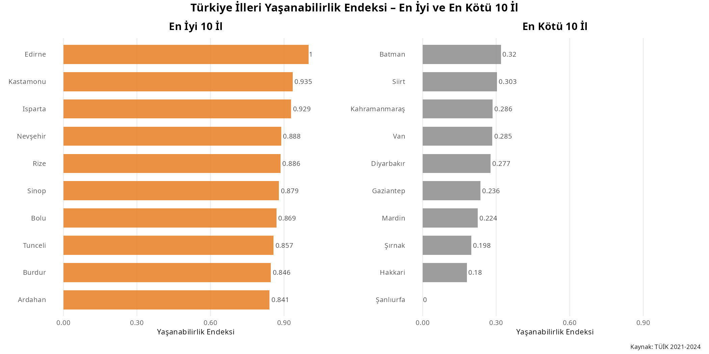

The heat map for the most livable cities is shown below. Edirne has higher scores for each category. Nevşehir has highest culture score but lowest health score among first 10 cities. Ardahan has highest education score but lowest culture score among first 10 cities. Culture scores of the first 10 cities have higher variation.

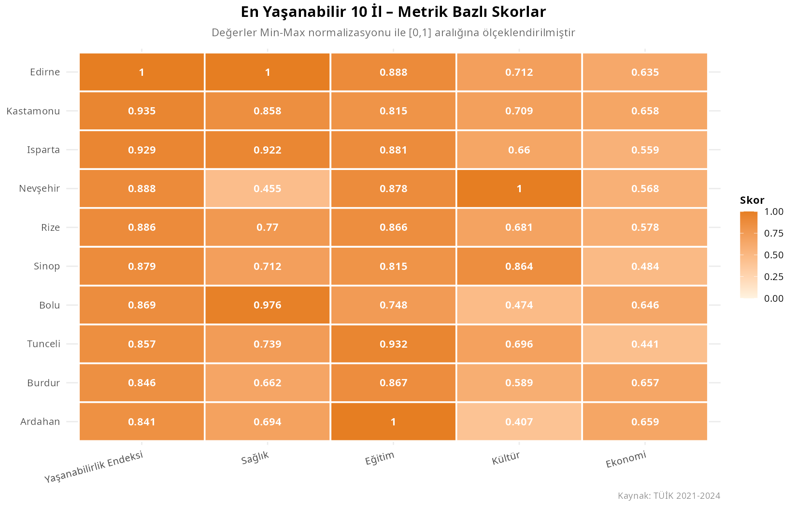

The box plot for livability of geographical regions is depicted below. The Black Sea region has the highest median of livability scores, while Southeastern Anatolia has the lowest. Mediterranean and Eastern Anatolia regions show wider distribution compared to the other regions, indicating greater variability among provinces within these areas. This broad spread suggests that some cities in these regions perform significantly better or worse than others in terms of livability. Marmara and Aegean regions display more compact distributions.

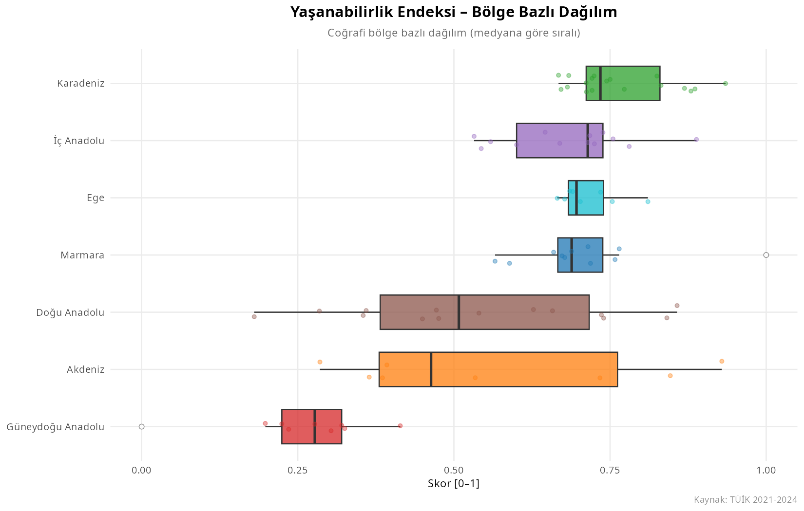

The box plot for health scores of geographical regions is depicted below. Same as livability index, Black Sea region has the highest median of health scores, while Southeastern Anatolia has the lowest. Mediterranean, Eastern Anatolia and Central Anatolia regions show wider distribution compared to the other regions, indicating greater variability among provinces within these areas. This broad spread suggests that some cities in these regions perform significantly better or worse than others in terms of livability. Aegean region displays more compact distributions.

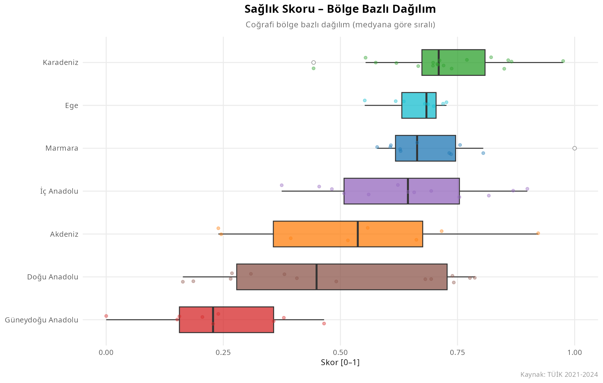

The box plot for education scores of geographical regions is depicted below. Same as livability index, Black Sea region has the highest median of education scores, while Southeastern Anatolia has the lowest.

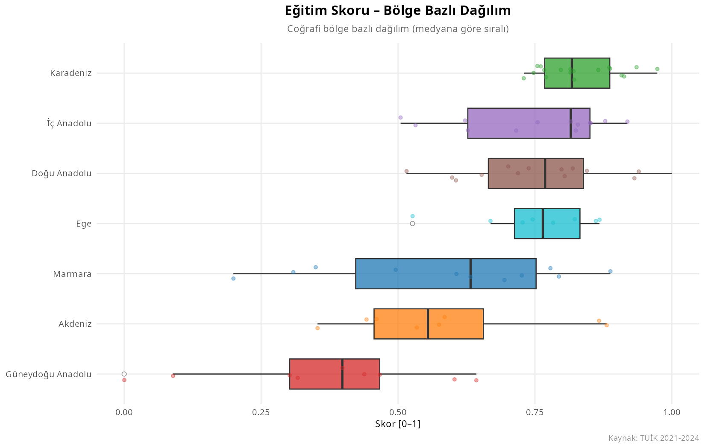

The box plot for culture scores of geographical regions is depicted below. Same as livability index, Black Sea region has the highest median of culture scores, while Southeastern Anatolia has the lowest. Aegean and Marmara regions display more compact distributions compared to other geographical regions.

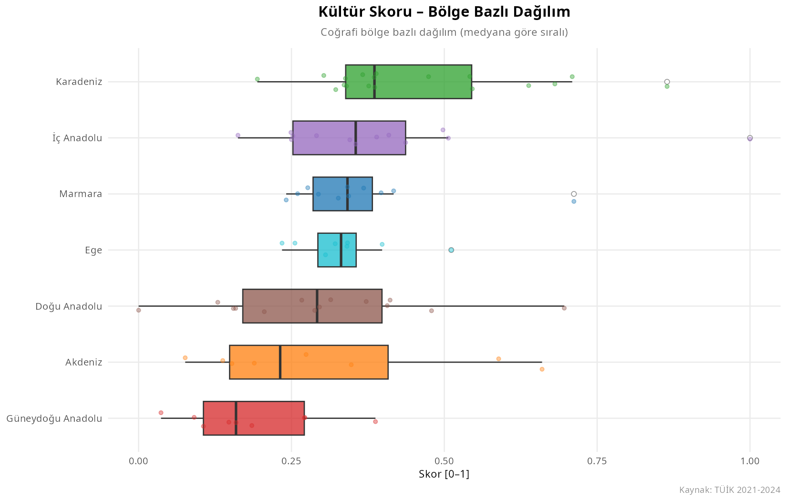

The box plot for economy scores of geographical regions is depicted below. Different from other categories, Marmara region has the highest median of economy scores. Southeastern Anatolia has the lowest median for economy score.

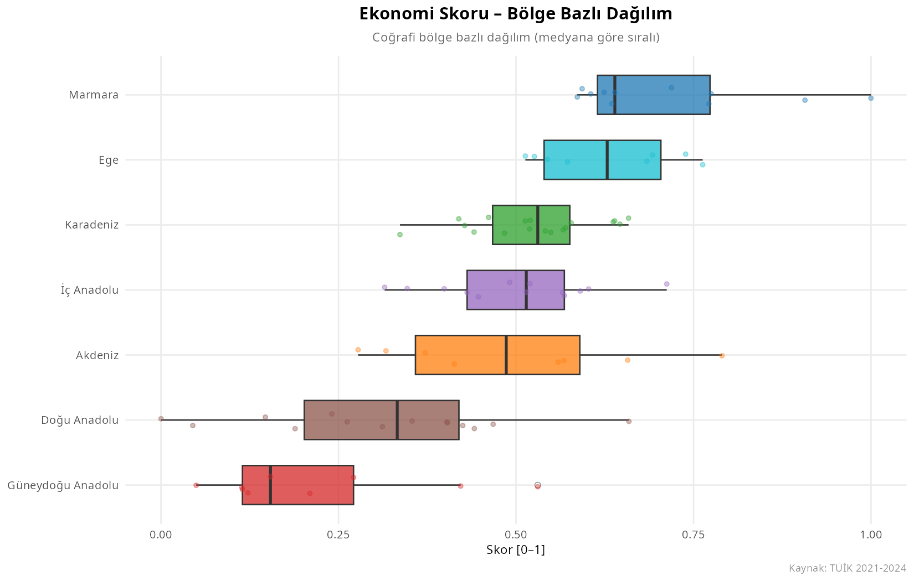

Below bar chart shows the average livability index scores with average category scores for each geographical region. Southeastern Anatolia region has lower scores than the other regions in every category. The average scores in the culture category are low across all geographical regions. The average scores in the education category are higher across all geographical regions.

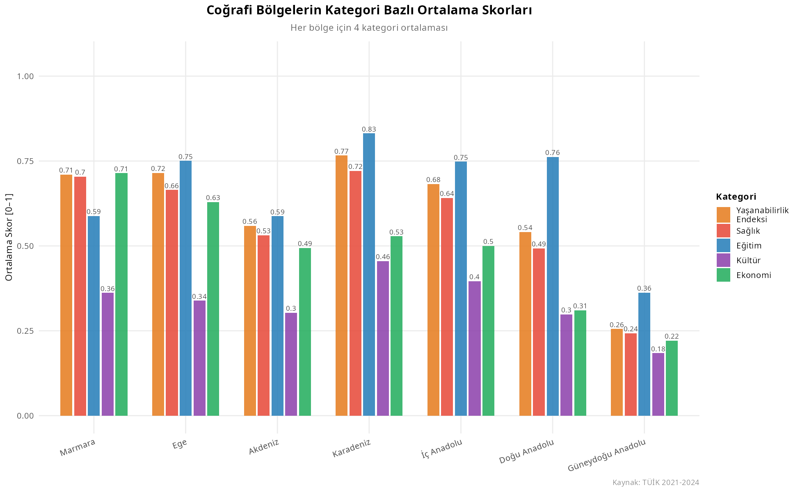

Livability indexes for all cities in Türkiye are shown below. According to this project, Edirne is the most livable city of Türkiye.

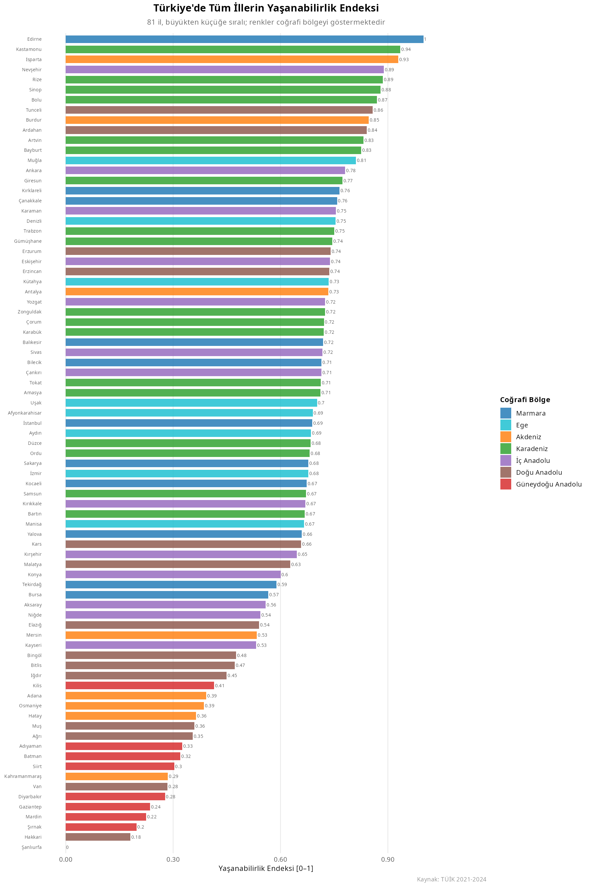

The first 3 most livable cities in each region and the comparison with my predictions are depicted below.

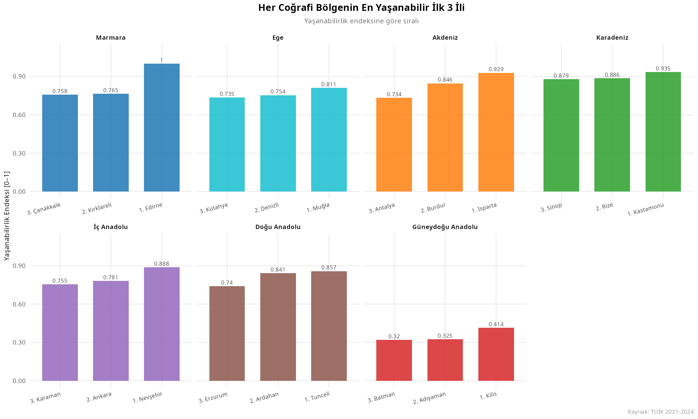

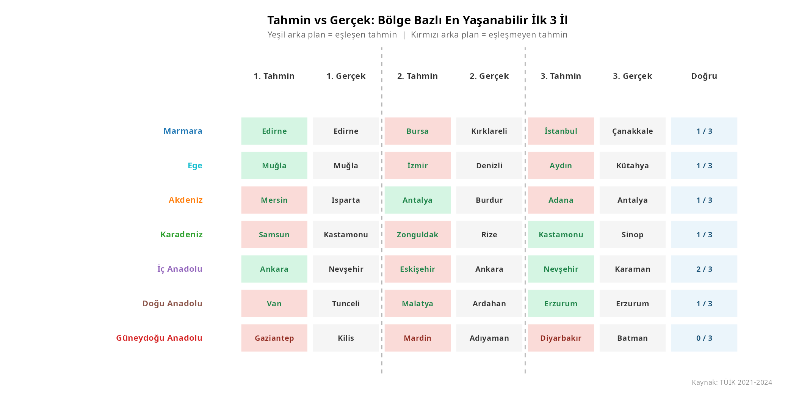

# 4. Results and Key Takeaways

The most livable city of Türkiye is Edirne from Marmara Region

## 4.1 Improvement Suggestions for Future Studies

As an improvement suggestion for this project, additional categories and indicators shall be added.

As an improvement suggestion for this project; a specific weight reflecting its relative importance in determining livability can be calculated. For example, the weighting used by ***The Global Liveability Index 2025***, which evaluates global cities based on multiple dimensions are:

-   Stability: 25%

-   Healthcare: 20%

-   Culture & Environment: 25%

-   Education: 10%

-   Infrastructure: 20%

# 5. References

Türkiye İstatistik Kurumu (TÜİK). (2026). Turkish Statistical Data Portal. https://data.tuik.gov.tr/

The Global Liveability Index. (2025). <https://image.b.economist.com/lib/fe8d13727c61047f7c/m/1/d95f9984-df44-41a6-84e7-9e7bc0b3c788.pdf>

Claude (Anthropic). (2025). AI-assisted R code generation and methodology design for composite index construction \[AI system\].

https://claude.ai

# 6. AI Prompt

**For preprocess of the data, Claude is used. The prompt used is below:**

*I am a master’s student in Industrial Engineering. I will develop a project in R using RStudio. I currently have beginner-level knowledge of R, so the code we create should be written in a beginner-friendly way with clear explanations and detailed comments, so that I can understand, analyze, and maintain the code myself. The project topic is to create a Livability Index for the provinces of Türkiye and determine the livability levels of both the geographical regions and the provinces. First, we will examine the 17 Excel files I provide and transform them into tidy format. Then, using these datasets, we will calculate the livability index.*

*The variables affected by population should be divided by the total population of each province. The variables that must be population-adjusted are: Number of ministry-affiliated museums, GSYS, Number of public libraries, Number of hospitals, Number of cinemas, Number of theaters, Total number of enterprises, and Total exports.*

*I will complete this project on my Linux computer. The folder structure for the project will be as follows: The main project folder will be called: `livability_index`*

*Inside the `data` folder:*

-   *`raw/` will contain 17 Excel data files*

-   *`toplam_nufus.xlsx` will contain the population data for each province and will be used for population-adjusted variables*

-   *`turkiye_iller_bolgeler.xlsx` will show which province belongs to which geographical region*

*Inside the `livability_index` folder, there will also be an `output/` folder where all outputs, tables, graphs, and results will be saved.*

*While developing the project:*

-   *Use beginner-friendly R syntax.*

-   *Explain each step clearly.*

-   *Add detailed comments to the code.*

-   *Prefer understandable solutions over overly advanced or complex methods.*

-   *Suggest improvements or better approaches when appropriate, but explain them simply.*

**To ensure the standardization of visuals, Claude is used. The prompt used is below:**

*For visualization, all visualizations should be visually consistent with one another. Therefore, always use the following color scheme:*

-   *Livability Index: orange*

-   *Health: red*

-   *Education: blue*

-   *Culture: purple*

-   *Economy: green*

*For region-based charts, assign a unique color to each geographical region and consistently use the same color for that region across all visualizations.*

*All charts should be created in the same format and saved into the output folder defined at the beginning of the project.*

1.  *The twelfth chart should compare the top 3 most livable provinces calculated for each geographical region with the provinces I predicted at the beginning of the project. My predictions were:*

    -   ***Marmara Region:** Edirne, Bursa, Istanbul*

    -   ***Aegean Region:** Muğla, Izmir, Aydın*

    -   ***Mediterranean Region:** Mersin, Antalya, Adana*

    -   ***Black Sea Region:** Samsun, Zonguldak, Kastamonu*

    -   ***Central Anatolia:** Ankara, Eskişehir, Nevşehir*

    -   ***Eastern Anatolia:** Van, Malatya, Erzurum*

    -   ***Southeastern Anatolia:** Gaziantep, Mardin, Diyarbakır*
